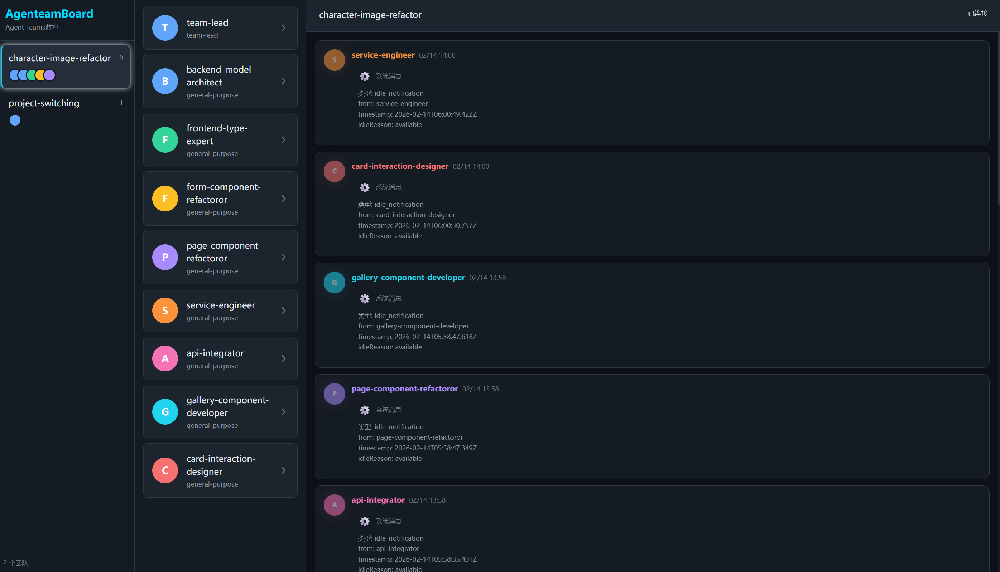

# AgenteamBoard

AI Agent 团队对话实时监控系统。

[English](README.md)

## 项目介绍

AgenteamBoard 是一个基于 Web 的实时监控仪表板，用于监控 AI agent 团队的对话。它提供可视化界面来跟踪消息、团队成员和跨多个 agent 团队的协作模式。




### 功能特性

- 📊 **团队管理** - 自动加载和监控多个 Agent 团队
- 👥 **成员列表** - 查看团队中的所有成员及其角色
- 💬 **消息监控** - 实时接收和显示团队对话消息
- 🔍 **消息筛选** - 按成员筛选消息，支持搜索功能
- 🎨 **现代界面** - 三栏布局，响应式设计，流畅的用户体验
- 🔄 **SSE 实时更新** - 通过 Server-Sent Events 实时推送新消息
- ⚙️ **系统消息** - 显示系统协议消息（非 JSON 格式）

## Claude Code Skill 使用方法

AgenteamBoard 可以作为 Claude Code 的 Skill 使用，让 Claude 自动识别何时需要启动团队监控。

### 安装 Skill

```bash
# 安装到 Claude Code
npm run install-skill

# 卸载
npm run uninstall-skill
```

### 在 Claude Code 中使用

安装后，Claude Code 会自动识别并使用此 skill，或者你可以明确要求：

```
使用 agenteam-board skill 监控我的 agent 团队
```

Skill 功能包括：
- 一键启动仪表板
- 实时团队对话监控
- 成员活动跟踪
- 系统消息检查

更多详情请查看 [skills/README.md](skills/README.md)。

## NPX 使用方法

### 前置要求

- Node.js >= 18.0.0
- npm 或 yarn

### 方式一：NPX（推荐）

一键安装并运行：

```bash
npx agenteam-board
```

这将自动：
- 启动后端 API 服务器（端口 3001+）
- 启动前端开发服务器（端口 3000+）
- 自动打开浏览器
- 显示 `~/.claude/teams` 中的所有团队

按 `Ctrl+C` 可同时停止两个服务。

### 方式二：从源码运行

1. 克隆仓库
```bash
git clone <repository-url>
cd AgenteamBoard
```

2. 安装依赖（自动安装所有 workspaces）
```bash
npm install
```

3. 运行开发服务器
```bash
npm run dev
```

或者分别启动后端和前端：
```bash
# 启动后端
npm run backend

# 在另一个终端启动前端
npm run frontend
```

4. 访问应用
```
前端: http://localhost:3000
API: http://localhost:3001
```

### 方式三：全局安装

```bash
# 全局安装
npm link

# 运行
agenteam-board

# 或者
npm run dev
```

## 技术原理

### 技术栈

#### 后端
- **Fastify** - 高性能 Web 框架
- **Node.js** - 运行时环境（>= 18.0.0）
- **Chokidar** - 文件监听，自动加载团队配置
- **SSE (Server-Sent Events)** - 实时消息推送

#### 前端
- **Vue 3** - 使用 Composition API
- **Pinia** - 状态管理
- **Vite** - 开发服务器和构建工具
- **TailwindCSS** - 实用优先的 CSS 框架
- **Vue Virtual Scroller** - 虚拟滚动，优化长列表性能

### 项目结构

```
agenteam-board/
├── package.json              # 根 package.json，定义 bin 和 workspaces
├── bin/
│   └── cli.js                # CLI 入口
├── packages/
│   ├── backend/              # 后端代码
│   │   ├── package.json
│   │   └── src/
│   │       ├── server.js     # 主服务器
│   │       ├── routes/       # API 路由
│   │       ├── services/     # 业务逻辑
│   │       └── utils/        # 工具函数
│   └── frontend/             # 前端代码
│       ├── package.json
│       ├── vite.config.js
│       ├── index.html
│       └── src/
├── skills/
│   └── agenteam-board/       # Claude Code skill
└── scripts/
    ├── install-skill.js      # Skill 安装脚本
    └── uninstall-skill.js    # Skill 卸载脚本
```

### 架构图

```
用户浏览器
    ↓
前端 (Vue 3 + Vite)
    ↓ HTTP/SSE
后端 (Fastify)
    ↓ 文件系统
~/.claude/teams/
    ├── team-1/
    │   ├── config.json       # 团队配置
    │   └── inboxes/          # 成员消息收件箱
    │       ├── agent1.json
    │       └── agent2.json
    └── team-2/
        ├── config.json
        └── inboxes/
```

### 工作原理

1. **后端初始化**
   - 从 `~/.claude/teams` 加载团队配置
   - 使用 Chokidar 设置文件监听器
   - 启动启用了 CORS 的 Fastify 服务器
   - 暴露 REST API 和 SSE 端点

2. **前端连接**
   - Vue 应用初始化 Pinia stores
   - 建立到 `/api/events` 的 SSE 连接
   - 通过 `/api/teams` 获取初始团队列表
   - 渲染三栏布局

3. **实时更新**
   - 文件变更触发 Chokidar 事件
   - 后端通过 SSE 广播更新
   - 前端接收并响应式更新 stores
   - UI 自动重新渲染

4. **消息流**
   - Agent 团队将消息写入收件箱文件
   - 文件监听器检测到变更
   - 后端读取并解析消息
   - SSE 推送到连接的客户端
   - 虚拟滚动器高效渲染消息

### API 端点

- `GET /api/teams` - 获取所有团队
- `GET /api/teams/:teamId/messages` - 获取指定团队的消息
- `GET /api/events` - SSE 实时事件流

### 配置

团队从 `~/.claude/teams` 目录加载。每个团队包含：

```json
{
  "id": "team-id",
  "name": "团队名称",
  "members": [
    {
      "name": "成员名称",
      "agentType": "agent 类型",
      "color": "blue"
    }
  ]
}
```

### UI 布局

1. **左侧栏** - 显示所有团队
2. **中间栏** - 显示选中团队的成员列表
3. **右侧栏** - 显示消息内容

### 导航流程

1. 点击团队 → 查看团队成员
2. 点击成员 → 筛选该成员的消息
3. 使用返回按钮 → 返回上一级视图

## 故障排除

### 团队列表为空

**问题**：仪表板显示空的团队列表

**解决方案**：
- 检查 `~/.claude/teams` 目录是否存在
- 验证团队配置文件是否为有效的 JSON
- 检查浏览器控制台的错误信息
- 确认文件权限正确

### SSE 连接失败

**问题**：SSE 连接失败或消息不更新

**解决方案**：
- 验证后端服务器正在运行（检查端口 3001+）
- 检查防火墙设置
- 刷新浏览器页面
- 检查浏览器网络面板的 SSE 连接状态
- 确认没有代理服务器缓冲 SSE 响应

### 端口冲突

**问题**：端口 3000-3010 被占用

**解决方案**：
- AgenteamBoard 使用 portfinder 自动查找可用端口
- 检查控制台输出以查看实际使用的端口
- 如需要，终止冲突的进程：
  ```bash
  # Windows
  netstat -ano | findstr :3001
  taskkill /PID <process-id> /F

  # Linux/Mac
  lsof -i :3001
  kill -9 <process-id>
  ```

### 前端代理错误

**问题**：前端无法连接到后端 API

**解决方案**：
- 检查 `packages/frontend/vite.config.js` 中的代理配置
- 确认环境变量 `API_PORT` 正确传递
- 验证后端 CORS 配置
- 检查浏览器控制台的 CORS 错误

### 性能问题

**问题**：消息列表渲染缓慢

**解决方案**：
- 虚拟滚动器已启用，但检查是否有大量消息
- 考虑实现消息分页
- 检查浏览器内存使用
- 优化消息筛选逻辑

## 性能优化建议

### 后端优化

1. **启用响应压缩**
```javascript
import compress from '@fastify/compress';
await fastify.register(compress);
```

2. **添加缓存头**
```javascript
fastify.get('/api/teams', async (request, reply) => {
  reply.header('Cache-Control', 'public, max-age=60');
  // ...
});
```

3. **限制消息数量**
```javascript
// 默认只返回最近 100 条消息
const messages = await loadTeamMessages(teamId, { limit: 100 });
```

### 前端优化

1. **懒加载组件**
```javascript
const MemberList = () => import('./components/MemberList.vue');
```

2. **虚拟滚动优化**
```vue
<RecycleScroller
  :items="messages"
  :item-size="80"
  key-field="id"
  :buffer="200"
>
```

3. **防抖搜索**
```javascript
import { debounce } from 'lodash-es';
const search = debounce((query) => {
  // 搜索逻辑
}, 300);
```

## 许可证

MIT License

## 贡献

欢迎提交 Issue 和 Pull Request！

### 开发指南

1. Fork 本仓库
2. 创建特性分支 (`git checkout -b feature/AmazingFeature`)
3. 提交更改 (`git commit -m 'Add some AmazingFeature'`)
4. 推送到分支 (`git push origin feature/AmazingFeature`)
5. 创建 Pull Request

### 代码规范

- 使用 ESLint 进行代码检查
- 遵循 Vue 3 Composition API 最佳实践
- 编写清晰的提交信息
- 添加必要的注释

## 相关项目

- [Claude Code](https://github.com/anthropics/claude-code) - AI 驱动的编程助手
- [Superpowers Marketplace](https://github.com/nickmillerdev/superpowers-marketplace) - Claude Code skills 市场
- [Fastify](https://github.com/fastify/fastify) - 高性能 Node.js Web 框架
- [Vue 3](https://github.com/vuejs/vue-next) - 渐进式 JavaScript 框架
